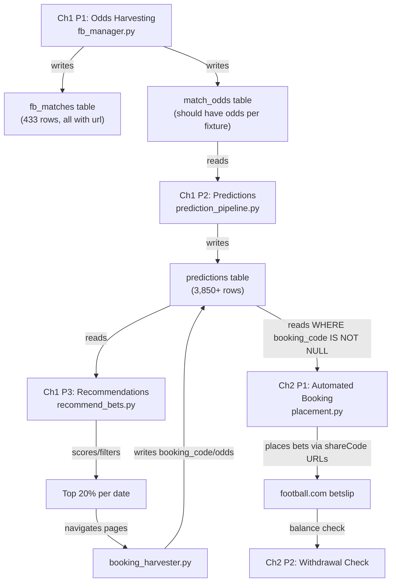

# LeoBook Pipeline Report: Ch1 → Ch2 Evidence-Based Flow Analysis

## Executive Summary

Traced **11 core files, ~5,000 lines of code** to map every data handoff from Ch1 P1 through Ch2 P2. Found **5 bugs, 2 dead code instances, and 1 critical data gap** that explain why `predictions.odds` is always empty and booking codes fail.

---

## Pipeline Architecture



---

## Ch1 P1: URL Resolution & Odds Harvesting

### Entry Point
[pipeline.py L154](file:///c:/Users/Admin/Desktop/ProProjection/LeoBook/Core/System/pipeline.py#L154) → [fb_manager.run_odds_harvesting()](file:///c:/Users/Admin/Desktop/ProProjection/LeoBook/Modules/FootballCom/fb_manager.py#L379)

### What It Does (step by step)

| Step | Function | Source File:Line | Data In | Data Out |
|------|----------|-----------------|---------|----------|
| 1 | [get_weekly_fixtures()](file:///c:/Users/Admin/Desktop/ProProjection/LeoBook/Core/Intelligence/prediction_pipeline.py#67-102) | [prediction_pipeline.py:67](file:///c:/Users/Admin/Desktop/ProProjection/LeoBook/Core/Intelligence/prediction_pipeline.py#L67) | [schedules](file:///c:/Users/Admin/Desktop/ProProjection/LeoBook/Data/Access/db_helpers.py#292-295) table | List of fixture dicts for next 7 days |
| 2 | [_filter_imminent_matches()](file:///c:/Users/Admin/Desktop/ProProjection/LeoBook/Modules/FootballCom/fb_manager.py#123-149) | [fb_manager.py:123](file:///c:/Users/Admin/Desktop/ProProjection/LeoBook/Modules/FootballCom/fb_manager.py#L123) | Fixture list | Removes matches starting within 30 min |
| 3 | [_load_fb_league_lookup()](file:///c:/Users/Admin/Desktop/ProProjection/LeoBook/Modules/FootballCom/fb_manager.py#110-119) | [fb_manager.py:110](file:///c:/Users/Admin/Desktop/ProProjection/LeoBook/Modules/FootballCom/fb_manager.py#L110) | [leagues.json](file:///c:/Users/Admin/Desktop/ProProjection/LeoBook/Data/Store/leagues.json) | `{league_id: entry}` for leagues with [fb_url](file:///c:/Users/Admin/Desktop/ProProjection/LeoBook/Data/Access/league_db.py#25-50) |
| 4 | Group by league_id | [fb_manager.py:419](file:///c:/Users/Admin/Desktop/ProProjection/LeoBook/Modules/FootballCom/fb_manager.py#L419) | Fixtures + lookup | `leagues_to_extract` dict |
| 5 | [_league_worker()](file:///c:/Users/Admin/Desktop/ProProjection/LeoBook/Modules/FootballCom/fb_manager.py#278-371) | [fb_manager.py:278](file:///c:/Users/Admin/Desktop/ProProjection/LeoBook/Modules/FootballCom/fb_manager.py#L278) | League fb_url | Navigates page, extracts match data, pairs with FS fixtures |
| 6 | `FixtureResolver.resolve()` | [fb_manager.py:510](file:///c:/Users/Admin/Desktop/ProProjection/LeoBook/Modules/FootballCom/fb_manager.py#L510) | FS fixture + candidates | Matched `match_row` with `fixture_id` |
| 7 | [save_site_matches()](file:///c:/Users/Admin/Desktop/ProProjection/LeoBook/Data/Access/db_helpers.py#627-654) | [fb_manager.py:519](file:///c:/Users/Admin/Desktop/ProProjection/LeoBook/Modules/FootballCom/fb_manager.py#L519) | matched row | → **`fb_matches` table** |
| 8 | [_odds_worker()](file:///c:/Users/Admin/Desktop/ProProjection/LeoBook/Modules/FootballCom/fb_manager.py#153-273) | [fb_manager.py:153](file:///c:/Users/Admin/Desktop/ProProjection/LeoBook/Modules/FootballCom/fb_manager.py#L153) | Match URL from `fb_matches` | Opens page, runs `OddsExtractor.extract()` |
| 9 | `OddsExtractor.extract()` | [odds_extractor.py:355](file:///c:/Users/Admin/Desktop/ProProjection/LeoBook/Modules/FootballCom/odds_extractor.py#L355) | Page DOM | JS extracts all outcomes from `div[data-market-id]` |
| 10 | [upsert_match_odds_batch()](file:///c:/Users/Admin/Desktop/ProProjection/LeoBook/Data/Access/league_db.py#1104-1146) | [odds_extractor.py:465](file:///c:/Users/Admin/Desktop/ProProjection/LeoBook/Modules/FootballCom/odds_extractor.py#L465) | Batch of odds dicts | → **[match_odds](file:///c:/Users/Admin/Desktop/ProProjection/LeoBook/Data/Access/db_helpers.py#661-670) table** |

### Guardrails
- `@AIGOSuite.aigo_retry(max_retries=2, delay=5.0)` — retry on failure
- [_filter_imminent_matches()](file:///c:/Users/Admin/Desktop/ProProjection/LeoBook/Modules/FootballCom/fb_manager.py#123-149) — drops matches < 30 min away
- [_create_session_no_login()](file:///c:/Users/Admin/Desktop/ProProjection/LeoBook/Modules/FootballCom/fb_manager.py#80-106) — anonymous browser, no login state
- Semaphore-bounded concurrency (`MAX_CONCURRENCY` pages)
- 3x retry loop per fixture if 0 outcomes extracted
- Debug screenshot on final 0-outcome result
- Batch checkpoint for resume on crash

### Outputs
- **`fb_matches` table**: [site_match_id](file:///c:/Users/Admin/Desktop/ProProjection/LeoBook/Data/Access/db_helpers.py#621-625), [url](file:///c:/Users/Admin/Desktop/ProProjection/LeoBook/Data/Access/db_helpers.py#341-360), `fixture_id`, [date](file:///c:/Users/Admin/Desktop/ProProjection/LeoBook/Modules/FootballCom/odds_extractor.py#78-92), `time`, `home_team`, `away_team`, [league](file:///c:/Users/Admin/Desktop/ProProjection/LeoBook/Data/Access/league_db.py#391-439)
- **[match_odds](file:///c:/Users/Admin/Desktop/ProProjection/LeoBook/Data/Access/db_helpers.py#661-670) table**: `fixture_id`, `market_id`, `exact_outcome`, [line](file:///c:/Users/Admin/Desktop/ProProjection/LeoBook/Modules/FootballCom/odds_extractor.py#283-289), `odds_value`, `base_market`, `category`

> [!CAUTION]
> **BUG 1 — [fb_manager.py](file:///c:/Users/Admin/Desktop/ProProjection/LeoBook/Modules/FootballCom/fb_manager.py) L571**: References `all_resolved` (undefined). Should be `all_resolved_matches`. This crashes the post-harvest Supabase sync silently after every Ch1 P1 session.
> ```python
> if all_resolved or total_session_odds_count > 0:  # ← NameError: all_resolved
> ```

---

## Ch1 P2: Prediction Pipeline

### Entry Point
[pipeline.py L172](file:///c:/Users/Admin/Desktop/ProProjection/LeoBook/Core/System/pipeline.py#L172) → [prediction_pipeline.run_predictions()](file:///c:/Users/Admin/Desktop/ProProjection/LeoBook/Core/Intelligence/prediction_pipeline.py#L242)

### What It Does (step by step)

| Step | Function | Source File:Line | Data In | Data Out |
|------|----------|-----------------|---------|----------|
| 1 | [get_weekly_fixtures()](file:///c:/Users/Admin/Desktop/ProProjection/LeoBook/Core/Intelligence/prediction_pipeline.py#67-102) | [prediction_pipeline.py:67](file:///c:/Users/Admin/Desktop/ProProjection/LeoBook/Core/Intelligence/prediction_pipeline.py#L67) | [schedules](file:///c:/Users/Admin/Desktop/ProProjection/LeoBook/Data/Access/db_helpers.py#292-295) table | Unplayed fixtures for next 7 days |
| 2 | Filter already-predicted | [prediction_pipeline.py:263](file:///c:/Users/Admin/Desktop/ProProjection/LeoBook/Core/Intelligence/prediction_pipeline.py#L263) | [predictions](file:///c:/Users/Admin/Desktop/ProProjection/LeoBook/Data/Access/league_db.py#828-835) table fixture_ids | Removes duplicates |
| 3 | Filter started matches | [prediction_pipeline.py:275](file:///c:/Users/Admin/Desktop/ProProjection/LeoBook/Core/Intelligence/prediction_pipeline.py#L275) | Current time | Removes matches already started today |
| 4 | [build_rule_engine_input()](file:///c:/Users/Admin/Desktop/ProProjection/LeoBook/Core/Intelligence/prediction_pipeline.py#143-231) | [prediction_pipeline.py:143](file:///c:/Users/Admin/Desktop/ProProjection/LeoBook/Core/Intelligence/prediction_pipeline.py#L143) | [schedules](file:///c:/Users/Admin/Desktop/ProProjection/LeoBook/Data/Access/db_helpers.py#292-295), [match_odds](file:///c:/Users/Admin/Desktop/ProProjection/LeoBook/Data/Access/db_helpers.py#661-670) | `{h2h_data, standings, real_odds}` |
| 5 | `RuleEngine.analyze()` | [prediction_pipeline.py:316](file:///c:/Users/Admin/Desktop/ProProjection/LeoBook/Core/Intelligence/prediction_pipeline.py#L316) | vision_data + `live_odds=real_odds` | Symbolic prediction with type, confidence, xG, tags |
| 6 | `SemanticRuleEngine.choose_market()` | [prediction_pipeline.py:320](file:///c:/Users/Admin/Desktop/ProProjection/LeoBook/Core/Intelligence/prediction_pipeline.py#L320) | fixture + xG | `chosen_market`, `market_id`, `statistical_edge` |
| 7 | `RLPredictor.predict()` | [prediction_pipeline.py:324](file:///c:/Users/Admin/Desktop/ProProjection/LeoBook/Core/Intelligence/prediction_pipeline.py#L324) | vision_data | Neural action probs, ML confidence |
| 8 | `EnsembleEngine.merge()` | [prediction_pipeline.py:337](file:///c:/Users/Admin/Desktop/ProProjection/LeoBook/Core/Intelligence/prediction_pipeline.py#L337) | Rule logits + RL logits + richness | Merged path, weights, confidence |
| 9 | [save_prediction()](file:///c:/Users/Admin/Desktop/ProProjection/LeoBook/Data/Access/db_helpers.py#83-149) | [prediction_pipeline.py:396](file:///c:/Users/Admin/Desktop/ProProjection/LeoBook/Core/Intelligence/prediction_pipeline.py#L396) | match_data + prediction | → **[predictions](file:///c:/Users/Admin/Desktop/ProProjection/LeoBook/Data/Access/league_db.py#828-835) table** |

### Guardrails
- `@AIGOSuite.aigo_retry(max_retries=2, delay=3.0)` — retry on failure
- Data quality gate: ≥ 3 form matches per team required ([L311](file:///c:/Users/Admin/Desktop/ProProjection/LeoBook/Core/Intelligence/prediction_pipeline.py#L311))
- SKIP filter: predictions with type="SKIP" are discarded ([L370](file:///c:/Users/Admin/Desktop/ProProjection/LeoBook/Core/Intelligence/prediction_pipeline.py#L370))
- Smart scheduling: max 1 prediction per team per week ([L415](file:///c:/Users/Admin/Desktop/ProProjection/LeoBook/Core/Intelligence/prediction_pipeline.py#L415))

### Real Odds Flow (the critical handoff)
[build_rule_engine_input()](file:///c:/Users/Admin/Desktop/ProProjection/LeoBook/Core/Intelligence/prediction_pipeline.py#143-231) at [L176-219](file:///c:/Users/Admin/Desktop/ProProjection/LeoBook/Core/Intelligence/prediction_pipeline.py#L176) fetches from [match_odds](file:///c:/Users/Admin/Desktop/ProProjection/LeoBook/Data/Access/db_helpers.py#661-670):
```python
rows = conn.execute(
    "SELECT market_id, exact_outcome, line, odds_value FROM match_odds WHERE fixture_id = ?",
    (fixture_id,)
).fetchall()
```
Then maps each to ACTIONS keys → `real_odds` dict → passed to `RuleEngine.analyze(live_odds=real_odds)`.

> [!CAUTION]
> **BUG 2 — [save_prediction](file:///c:/Users/Admin/Desktop/ProProjection/LeoBook/Data/Access/db_helpers.py#83-149) at [db_helpers.py L121](file:///c:/Users/Admin/Desktop/ProProjection/LeoBook/Data/Access/db_helpers.py#L121)**: The [odds](file:///c:/Users/Admin/Desktop/ProProjection/LeoBook/Core/Intelligence/betting_markets.py#276-282) column is populated from `prediction_result.get('odds', '')`. But **RuleEngine does NOT return an [odds](file:///c:/Users/Admin/Desktop/ProProjection/LeoBook/Core/Intelligence/betting_markets.py#276-282) key**. The prediction pipeline at [L346-356](file:///c:/Users/Admin/Desktop/ProProjection/LeoBook/Core/Intelligence/prediction_pipeline.py#L346) copies rule_prediction and adds `chosen_market`, `market_id`, `ensemble_path` etc. — but **never sets `prediction['odds']`**.
>
> **This is WHY `predictions.odds` is always empty.** The real odds exist in `real_odds` dict at runtime but are never carried through to the save call.

---

## Ch1 P3: Recommendations & Booking Code Harvest

### Entry Point
[pipeline.py L189](file:///c:/Users/Admin/Desktop/ProProjection/LeoBook/Core/System/pipeline.py#L189) → two sequential steps:
1. [get_recommendations(save_to_file=True)](file:///c:/Users/Admin/Desktop/ProProjection/LeoBook/Scripts/recommend_bets.py#123-315) — scoring/filtering
2. [harvest_booking_codes_for_recommendations()](file:///c:/Users/Admin/Desktop/ProProjection/LeoBook/Modules/FootballCom/booker/booking_harvester.py#310-415) — browser-based booking code extraction

### Step 1: Recommendations Scoring

| Step | Function | Source File:Line | Data In | Data Out |
|------|----------|-----------------|---------|----------|
| 1 | [load_data()](file:///c:/Users/Admin/Desktop/ProProjection/LeoBook/Scripts/recommend_bets.py#73-76) | [recommend_bets.py:73](file:///c:/Users/Admin/Desktop/ProProjection/LeoBook/Scripts/recommend_bets.py#L73) | [predictions](file:///c:/Users/Admin/Desktop/ProProjection/LeoBook/Data/Access/league_db.py#828-835) table (all rows) | All prediction dicts |
| 2 | [calculate_market_reliability()](file:///c:/Users/Admin/Desktop/ProProjection/LeoBook/Scripts/recommend_bets.py#77-122) | [recommend_bets.py:77](file:///c:/Users/Admin/Desktop/ProProjection/LeoBook/Scripts/recommend_bets.py#L77) | Historical predictions with outcomes | `{market: {overall, recent, trend}}` |
| 3 | Filter future matches | [recommend_bets.py:140](file:///c:/Users/Admin/Desktop/ProProjection/LeoBook/Scripts/recommend_bets.py#L140) | Current time | Only future unreviewed predictions |
| 4 | Scoring formula | [recommend_bets.py:182](file:///c:/Users/Admin/Desktop/ProProjection/LeoBook/Scripts/recommend_bets.py#L182) | reliability + confidence | `score = overall*0.3 + recent*0.5 + conf*0.2` |
| 5 | Tier filtering | [recommend_bets.py:191](file:///c:/Users/Admin/Desktop/ProProjection/LeoBook/Scripts/recommend_bets.py#L191) | likelihood + score | Tier 1(>70%): always, Tier 2: score>0.6, Tier 3: score>0.8+recent>0.6 |
| 6 | Save JSON + TXT | [recommend_bets.py:269](file:///c:/Users/Admin/Desktop/ProProjection/LeoBook/Scripts/recommend_bets.py#L269) | Scored recommendations | `recommended.json` + TXT file |

> [!WARNING]
> **Missing: No Stairway odds gate in recommend_bets.py.** The tier filtering checks likelihood/score/momentum but **never checks `predictions.odds`** or Stairway range [1.20, 4.00]. This is because `predictions.odds` is always empty (Bug 2). The odds gate only exists downstream in `booking_harvester._find_and_click_outcome()` at runtime.

### Step 2: Booking Code Harvest

| Step | Function | Source File:Line | Data In | Data Out |
|------|----------|-----------------|---------|----------|
| 1 | [_select_top_per_date()](file:///c:/Users/Admin/Desktop/ProProjection/LeoBook/Modules/FootballCom/booker/booking_harvester.py#109-128) | [booking_harvester.py:109](file:///c:/Users/Admin/Desktop/ProProjection/LeoBook/Modules/FootballCom/booker/booking_harvester.py#L109) | Sorted recommendations | Top 20% per date |
| 2 | [_get_match_url_for_fixture()](file:///c:/Users/Admin/Desktop/ProProjection/LeoBook/Modules/FootballCom/booker/booking_harvester.py#91-107) | [booking_harvester.py:91](file:///c:/Users/Admin/Desktop/ProProjection/LeoBook/Modules/FootballCom/booker/booking_harvester.py#L91) | fixture_id | Match URL from `fb_matches` |
| 3 | Navigate to match page | [booking_harvester.py:367](file:///c:/Users/Admin/Desktop/ProProjection/LeoBook/Modules/FootballCom/booker/booking_harvester.py#L367) | match_url | Page loaded |
| 4 | [_find_and_click_outcome()](file:///c:/Users/Admin/Desktop/ProProjection/LeoBook/Modules/FootballCom/booker/booking_harvester.py#137-243) | [booking_harvester.py:137](file:///c:/Users/Admin/Desktop/ProProjection/LeoBook/Modules/FootballCom/booker/booking_harvester.py#L137) | prediction + market | Clicks outcome, returns odds |
| 5 | [_click_book_bet_and_extract_code()](file:///c:/Users/Admin/Desktop/ProProjection/LeoBook/Modules/FootballCom/booker/booking_harvester.py#245-285) | [booking_harvester.py:245](file:///c:/Users/Admin/Desktop/ProProjection/LeoBook/Modules/FootballCom/booker/booking_harvester.py#L245) | Page state | Booking code string |
| 6 | [_save_booking_code_to_db()](file:///c:/Users/Admin/Desktop/ProProjection/LeoBook/Modules/FootballCom/booker/booking_harvester.py#59-89) | [booking_harvester.py:59](file:///c:/Users/Admin/Desktop/ProProjection/LeoBook/Modules/FootballCom/booker/booking_harvester.py#L59) | code + odds + URL | → `predictions.booking_code`, `booking_odds`, `booking_url` |

> [!CAUTION]
> **BUG 3 — [booking_harvester.py L98](file:///c:/Users/Admin/Desktop/ProProjection/LeoBook/Modules/FootballCom/booker/booking_harvester.py#L98)**: Queries `SELECT match_url FROM fb_matches WHERE fixture_id = ?` but the column is [url](file:///c:/Users/Admin/Desktop/ProProjection/LeoBook/Data/Access/db_helpers.py#341-360), not [match_url](file:///c:/Users/Admin/Desktop/ProProjection/LeoBook/Modules/FootballCom/booker/booking_harvester.py#91-107). This returns NULL for every row → `skipped_no_url` for every recommendation. **No booking codes can ever be harvested.**

> [!CAUTION]
> **BUG 4 — [booking_harvester.py L35-37](file:///c:/Users/Admin/Desktop/ProProjection/LeoBook/Modules/FootballCom/booker/booking_harvester.py#L35)**: Uses old broken selectors:
> ```python
> _SEL_OUTCOME_LABEL = ".m-table-row > div > span.un-text-rem-\\[12px\\]"  # OLD
> _SEL_OUTCOME_ODDS  = ".m-table-row > div > span.un-text-rem-\\[14px\\].un-font-bold"  # OLD
> ```
> These were the exact selectors we fixed in [odds_extractor.py](file:///c:/Users/Admin/Desktop/ProProjection/LeoBook/Modules/FootballCom/odds_extractor.py). They need to be:
> ```python
> _SEL_OUTCOME_LABEL = "span.un-text-encore-text-type-one-tertiary"  # NEW
> _SEL_OUTCOME_ODDS  = "span.un-text-encore-brand-secondary"  # NEW
> ```

---

## Ch2 P1: Automated Booking (Bet Placement)

### Entry Point
[pipeline.py L243](file:///c:/Users/Admin/Desktop/ProProjection/LeoBook/Core/System/pipeline.py#L243) → [fb_manager.run_automated_booking()](file:///c:/Users/Admin/Desktop/ProProjection/LeoBook/Modules/FootballCom/fb_manager.py#L602)

### Pre-Chapter 2 Guardrails
[pipeline.py L370](file:///c:/Users/Admin/Desktop/ProProjection/LeoBook/Core/System/pipeline.py#L370):
```python
ok, reason = run_all_pre_bet_checks(conn, state.get("current_balance", 0))
if not ok:
    print(f"  [GUARDRAIL] Chapter 2 BLOCKED: {reason}")
    return
```

### What It Does (step by step)

| Step | Function | Source File:Line | Data In | Data Out |
|------|----------|-----------------|---------|----------|
| 1 | [check_kill_switch()](file:///c:/Users/Admin/Desktop/ProProjection/LeoBook/Core/System/guardrails.py#47-55) | [guardrails.py:47](file:///c:/Users/Admin/Desktop/ProProjection/LeoBook/Core/System/guardrails.py#L47) | `STOP_BETTING` file | HALT if exists |
| 2 | [is_dry_run()](file:///c:/Users/Admin/Desktop/ProProjection/LeoBook/Core/System/guardrails.py#40-43) | [guardrails.py:40](file:///c:/Users/Admin/Desktop/ProProjection/LeoBook/Core/System/guardrails.py#L40) | `--dry-run` flag | Skip if dry-run |
| 3 | [get_pending_predictions_by_date()](file:///c:/Users/Admin/Desktop/ProProjection/LeoBook/Modules/FootballCom/fb_setup.py#8-33) | [fb_setup.py:8](file:///c:/Users/Admin/Desktop/ProProjection/LeoBook/Modules/FootballCom/fb_setup.py#L8) | [predictions](file:///c:/Users/Admin/Desktop/ProProjection/LeoBook/Data/Access/league_db.py#828-835) table | Grouped by date |
| 4 | [place_stairway_accumulator()](file:///c:/Users/Admin/Desktop/ProProjection/LeoBook/Modules/FootballCom/booker/placement.py#210-390) | [placement.py:211](file:///c:/Users/Admin/Desktop/ProProjection/LeoBook/Modules/FootballCom/booker/placement.py#L211) | Page + balance | Builds & places accumulator |

### placement.py Stairway Logic

The accumulator builder at [L244-260](file:///c:/Users/Admin/Desktop/ProProjection/LeoBook/Modules/FootballCom/booker/placement.py#L244) reads:
```sql
SELECT fixture_id, home_team, away_team, prediction,
       confidence, booking_code, booking_odds, booking_url, date
FROM predictions
WHERE booking_code IS NOT NULL
  AND booking_odds BETWEEN 1.20 AND 4.00
  AND date = ?
ORDER BY confidence ASC, recommendation_score DESC
```

**Then applies:**
1. `filter_and_rank_candidates()` — safety gate filter
2. Greedy accumulator: max `ACCA_MAX_LEGS` legs, one per fixture, total odds ≤ `ACCA_TOTAL_ODDS_MAX`
3. If total odds < `STAIRWAY_TOTAL_MIN` → skip today
4. Load each selection via booking URL (`shareCode`)
5. Verify slip count
6. Fill stake from [StaircaseTracker().get_current_step_stake()](file:///c:/Users/Admin/Desktop/ProProjection/LeoBook/Core/System/guardrails.py#71-176)
7. Click Place Bet
8. Verify balance drop (expected ≥ 90% of stake)
9. Mark all as "booked"

### Guardrails (6 total)
1. **Kill switch** — `STOP_BETTING` file → HALT
2. **Dry-run mode** — `--dry-run` → log only
3. **[run_all_pre_bet_checks()](file:///c:/Users/Admin/Desktop/ProProjection/LeoBook/Core/System/guardrails.py#234-265)** — balance sanity + daily loss limit
4. **Safety gate** — `filter_and_rank_candidates()` — rejects low-quality candidates
5. **Stairway accumulator validator** — odds range [1.20–4.00], total [3.5–5.0], max 8 legs
6. **Balance drop verification** — confirms bet was actually placed

---

## Ch2 P2: Withdrawal Check

### Entry Point
[pipeline.py L258](file:///c:/Users/Admin/Desktop/ProProjection/LeoBook/Core/System/pipeline.py#L258)

Launches browser → extracts balance → checks triggers → proposes + executes withdrawal if approved. Self-contained, no dependency on earlier chapters except balance.

---

## Bug Summary

| # | File:Line | Severity | Description |
|---|-----------|----------|-------------|
| 1 | [fb_manager.py:571](file:///c:/Users/Admin/Desktop/ProProjection/LeoBook/Modules/FootballCom/fb_manager.py#L571) | **HIGH** | `all_resolved` undefined → `NameError` → post-harvest Supabase sync never runs |
| 2 | [db_helpers.py:121](file:///c:/Users/Admin/Desktop/ProProjection/LeoBook/Data/Access/db_helpers.py#L121) | **CRITICAL** | `predictions.odds` always empty — `prediction_result` never contains [odds](file:///c:/Users/Admin/Desktop/ProProjection/LeoBook/Core/Intelligence/betting_markets.py#276-282) key |
| 3 | [booking_harvester.py:98](file:///c:/Users/Admin/Desktop/ProProjection/LeoBook/Modules/FootballCom/booker/booking_harvester.py#L98) | **CRITICAL** | Queries [match_url](file:///c:/Users/Admin/Desktop/ProProjection/LeoBook/Modules/FootballCom/booker/booking_harvester.py#91-107) column but actual column is [url](file:///c:/Users/Admin/Desktop/ProProjection/LeoBook/Data/Access/db_helpers.py#341-360) → 0 booking codes harvested |
| 4 | [booking_harvester.py:35-37](file:///c:/Users/Admin/Desktop/ProProjection/LeoBook/Modules/FootballCom/booker/booking_harvester.py#L35) | **HIGH** | Old broken selectors (`un-font-bold`) → can't find outcomes on page |
| 5 | [recommend_bets.py](file:///c:/Users/Admin/Desktop/ProProjection/LeoBook/Scripts/recommend_bets.py) | **MEDIUM** | No Stairway odds gate — filtered only at booking time, not at recommendation time |

---

## Dead Code / Architecture Debt

| Item | Location | Status |
|------|----------|--------|
| [run_football_com_booking()](file:///c:/Users/Admin/Desktop/ProProjection/LeoBook/Modules/FootballCom/fb_manager.py#680-684) | [fb_manager.py:680](file:///c:/Users/Admin/Desktop/ProProjection/LeoBook/Modules/FootballCom/fb_manager.py#L680) | Dead wrapper — never called |
| [place_bets_for_matches()](file:///c:/Users/Admin/Desktop/ProProjection/LeoBook/Modules/FootballCom/booker/placement.py#66-164) | [placement.py:66](file:///c:/Users/Admin/Desktop/ProProjection/LeoBook/Modules/FootballCom/booker/placement.py#L66) | Old legacy flow — replaced by [place_stairway_accumulator()](file:///c:/Users/Admin/Desktop/ProProjection/LeoBook/Modules/FootballCom/booker/placement.py#210-390) |

---

## Data Flow Integrity Chain

```
schedules → get_weekly_fixtures() → Ch1P1 resolves to fb_matches
                                   → Ch1P1 extracts to match_odds ✅
match_odds → Ch1P2 build_rule_engine_input() reads real_odds ✅
          → Ch1P2 passes live_odds to RuleEngine ✅
          → Ch1P2 saves prediction BUT odds field empty ❌ (Bug 2)

predictions → Ch1P3 recommend_bets scores/filters ✅
           → Ch1P3 booking_harvester tries to get URL ❌ (Bug 3 — wrong column)
           → Ch1P3 booking_harvester tries to click outcome ❌ (Bug 4 — old selectors)
           → Ch1P3 booking_harvester saves booking_code... never reached

predictions WHERE booking_code IS NOT NULL → Ch2P1 — 0 rows always (Bugs 3+4)
```

> [!IMPORTANT]
> **Root Cause Chain**: Bug 3 (wrong column name) → 0 URLs found → 0 booking codes harvested → `booking_code IS NOT NULL` returns 0 rows → Ch2 P1 has nothing to place. Even if Bug 3 were fixed, Bug 4 (old selectors) would prevent outcome clicks. Even if both were fixed, Bug 2 means `predictions.odds` is still empty for the UI.
